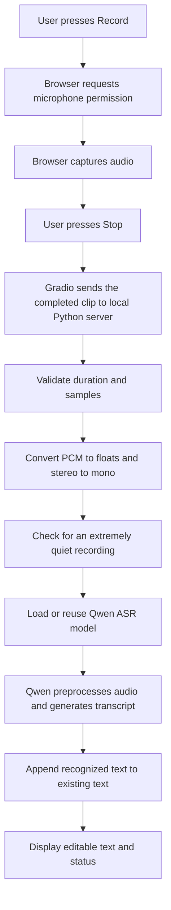

# Qwen Voice Typing

A local starter project that turns microphone recordings into editable text.
Click Record, speak, then click Stop. Recognition starts automatically after Stop.
Each successful clip adds a paragraph to the text box. No API key is required.

This version transcribes complete clips. It does not display partial words while
you are talking, detect the identity of the speaker, or type into other apps.
The interface and recognition engine run on your computer.

See [VERIFICATION.md](VERIFICATION.md) for installation results and remaining
verification gaps. In this workspace, dependencies are installed, but the model
weights download and actual speech recognition still need to complete.

## 1. Installation and launch on Windows

Open PowerShell in this directory. With uv installed:

```powershell
.\install.ps1
.\run.ps1
```

If PowerShell blocks scripts, you can run the following commands directly without
changing the execution policy:

```powershell
$env:UV_CACHE_DIR = "$PWD\.cache\uv"
$env:UV_PYTHON_INSTALL_DIR = "$PWD\.cache\python"
uv python install 3.12
uv venv --python 3.12 .venv
uv pip install --python .venv\Scripts\python.exe -r requirements.txt
.\.venv\Scripts\python.exe app.py
```

Alternatively, if you already have Python 3.12 installed with the Windows launcher:

```powershell
py -3.12 -m venv .venv
.\.venv\Scripts\python.exe -m pip install -r requirements.txt
.\.venv\Scripts\python.exe app.py
```

Open http://127.0.0.1:7860 in your browser if it does not open automatically.
Allow microphone access. Select a spoken language, record a short sentence, and
press Stop. The first recognition request downloads the model and loads it into
memory; later requests reuse it. Keep each clip under 60 seconds. Longer clips
are rejected by the backend rather than automatically stopped in the browser.

The model cache is `.cache/huggingface`. An internet connection is needed to
install packages and retrieve uncached model files. Once all files are cached,
you can test offline startup with `$env:HF_HUB_OFFLINE = '1'` before launching.
The app does not intentionally send recorded speech to a cloud transcription API.

### CPU and GPU

The application checks `torch.cuda.is_available()` at launch. It selects an NVIDIA
CUDA device if available; otherwise it uses CPU float32. CPU support in this
starter is a fallback configuration and performance must be measured on your
machine. Do not assume it will provide a real-time experience.

Check the installed PyTorch build:

```powershell
.\.venv\Scripts\python.exe -c "import torch; print(torch.__version__); print('CUDA:', torch.cuda.is_available())"
```

The default dependency installation may install a CPU build. If you have an
NVIDIA GPU and need CUDA, use the command generated by the official
[PyTorch installation selector](https://pytorch.org/get-started/locally/) for
Windows/Pip and your supported CUDA version. Target this project's Python, not
the system Python. With uv, translate its `pip install ...` command into
`uv pip install --python .venv\Scripts\python.exe ...`. Rerun the CUDA check.
An installed graphics card alone does not mean this Python environment can use it.

You can override settings before launching:

```powershell
$env:QWEN_DEVICE = 'cpu'
$env:QWEN_MODEL = 'Qwen/Qwen3-ASR-0.6B'
.\.venv\Scripts\python.exe app.py
```

The larger `Qwen/Qwen3-ASR-1.7B` model can be selected with the same variable.
This project uses the qwen-asr package and its original checkpoint names; do not
substitute a native Transformers `-hf` checkpoint without changing the loader.
Package pins follow the package's own compatible Transformers dependency. Do
not independently upgrade Transformers just because a newer release exists.

## 2. System flow, step by step



### Step 1: Start the local application

Python creates a Gradio web interface and listens on 127.0.0.1:7860. The browser
is the user interface; Python performs recognition. The loopback address makes
the server available on the same computer. The model loads lazily, so opening
the page does not itself download model weights.

### Step 2: Capture the microphone

Pressing Record asks the browser to use the selected microphone. Once allowed,
the browser records sound samples. Audio is a sequence of numeric amplitudes,
not words. For example, a sample rate of 48,000 Hz means 48,000 samples per second
per channel. The actual sample rate depends on the recording path.

Microphone permission belongs to the browser and operating system. The Python
server cannot grant that permission. You should see an active recording indicator
while recording. Press Stop when the sentence or short paragraph is finished.

### Step 3: Deliver the completed clip

The Gradio `stop_recording` event calls `dictate`, which invokes `recognize`. With `type='numpy'`, the
callback receives `(sample_rate, sample_array)`. It also receives the chosen
language and the text currently in the editor. Only one inference is processed
at a time, avoiding simultaneous use of the shared model.

The editor and recorder are temporarily disabled while recognition runs and
re-enabled when the result returns. Wait for that result before editing or
making another recording. This small starter takes a snapshot of the editor
when the request starts. A production editor that allows simultaneous typing
should use revision IDs or a client-side append operation to preserve edits
made while recognition is running.

### Step 4: Validate and normalize the audio

`prepare_audio` rejects missing audio, empty samples, invalid sample rates,
non-finite numbers, unsupported dimensions, and clips longer than 60 seconds.
Signed 16-bit PCM typically ranges from -32768 to 32767. Dividing by 32768
converts it to approximately -1 to +1. Stereo channels are averaged into mono.
Float input is kept as float32, and amplitudes are clipped to the expected range.

The app then measures root mean square amplitude. Extremely quiet clips are
returned without model inference. This is a simple silence check, not voice
activity detection: music, fan noise, or other sounds can still pass it.

The app preserves the true sample rate in the tuple it passes to Qwen. It does
not pretend a 48 kHz recording is 16 kHz by changing a number. The model package
handles the input preprocessing required by its recognizer.

### Step 5: Load the recognition model once

On the first non-silent request, `get_model()` downloads missing files and builds
the Qwen model. On later requests, it returns the same in-memory model. Loading
on every sentence would repeatedly pay the download/cache lookup and memory
initialization costs. Restarting Python clears the in-memory instance but leaves
downloaded files cached on disk.

The starter chooses 0.6B to keep the initial model smaller. Batch size is one
because the app is designed for one local user. Its generation cap is 512 tokens;
very dense speech can hit that cap, so short clips are preferable. A token is a
model text unit and is not necessarily one word.

### Step 6: Recognize speech

The call is:

```python
result = model.transcribe(
    audio=(samples, sample_rate),
    language=None,  # or a supported language name such as 'English'
)[0]
```

Conceptually, the recognition engine transforms acoustic information into an
internal representation and decodes likely text. It returns text and a language
label. The starter does not perform a separate grammar rewrite, translation,
speaker verification, or command execution. A wrong name or technical term
should be corrected in the editor. Language detection is not speaker identity.

### Step 7: Put the result into the editor

The callback trims surrounding whitespace and appends a nonempty result as a new
paragraph. Gradio updates the text box directly. It does not simulate keyboard
presses. This is how automatic typing works inside this particular project.

For example, if the editor contains `Meeting notes` and you say `We will meet on
Friday`, the result becomes:

```text
Meeting notes
We will meet on Friday.
```

The precise punctuation is model-dependent. You can edit the text manually or
use the copy button. Text is not automatically persisted to a database or file.
Refreshing the page or closing the session can lose the current document.

### Step 8: Report completion or preserve text on failure

The status field displays detected language, elapsed callback time, and device.
The first time includes loading and downloading, so it is not a clean inference
benchmark. On a handled validation or inference error, the previous text is
returned intact with a readable error. A browser upload or connection failure
can occur before the callback and will be shown by Gradio instead.

Temporary audio is managed by Gradio under `.cache/audio`; cleanup checks run
approximately hourly for files old enough to remove. Closing the server before
cleanup can leave files behind. This app should not be described as zero-retention.

## 3. What determines delay and accuracy?

The visible delay after Stop includes upload to localhost, audio decoding,
preprocessing, waiting for the model, inference, and updating the browser.
First-run setup is an additional cost. Faster hardware cannot eliminate time
spent waiting for the user to finish recording.

Test with 5-10 second clips first. Measure subsequent requests after the model
has loaded. Try your actual microphone, language, accent, background noise,
names, and specialist vocabulary. A clean headset recording often gives the
recognizer more useful input than a distant laptop microphone. These are test
conditions, not a guarantee of accuracy.

## 4. Upgrading to continuous automatic dictation

If you want to click Start once, speak naturally, and have text appear during
pauses, add a streaming capture path and a speech endpoint detector. The current
project does not implement these features.

The design would be:

1. Capture short audio frames continuously while listening is enabled.
2. Use voice activity detection (VAD) to decide whether frames contain speech.
3. Keep a brief audio pre-roll so detection does not cut off the first syllable.
4. After a configurable quiet period, finalize the current utterance; enforce a
   maximum length even if the speaker never pauses.
5. Queue complete utterances with sequence IDs and bounded memory. If inference
   falls behind, show a backlog warning rather than silently dropping speech.
6. Append final results in sequence order, once per utterance ID.
7. For partial-word display, use a streaming recognizer and maintain a separate
   temporary text region that can change. Commit only finalized text to the
   permanent document so changing hypotheses do not create duplicates.
8. Stop microphone tracks when the user presses Stop or closes the interface.

Qwen's documented package streaming route uses its vLLM backend. That is a
separate deployment choice from this starter's Transformers backend. Follow the
official streaming example when implementing that route rather than repeatedly
transcribing an ever-growing recording and appending all returned text.

## 5. Project map and checks

| File | Purpose |
| --- | --- |
| app.py | UI, model initialization, recognition callback, local launch |
| audio_utils.py | Audio validation, normalization, and text append behavior |
| requirements.txt | Direct dependencies |
| install.ps1 | Isolated Python environment and dependency setup |
| run.ps1 | Start the application |
| test_audio_utils.py | Checks for audio conversion and invalid inputs |
| check_model.py | Download/load the model and transcribe Qwen's public sample |
| requirements-windows.lock.txt | Exact versions installed during setup |
| VERIFICATION.md | Verified checks and remaining limitations |

Run the lightweight checks:

```powershell
.\.venv\Scripts\python.exe -m unittest -v
```

These tests do not establish recognition accuracy. A real audio smoke test and
a browser microphone test are separate checks. For shared/public deployment,
add HTTPS, authentication, request limits, per-user storage rules, and deliberate
retention settings before exposing the server beyond localhost.

## 6. Troubleshooting

| Symptom | What to check |
| --- | --- |
| Microphone unavailable | Browser permission, Windows microphone access, selected input device; use localhost |
| First request looks slow | Model download and initialization; check terminal output |
| CUDA is False | PyTorch build and NVIDIA driver; use the official PyTorch installer selector |
| Out of GPU memory | Close other GPU jobs, keep the smaller model, shorten clips, or use CPU |
| Missing FFmpeg error | Install FFmpeg if your recording format requires it; restart the shell so PATH is refreshed |
| Download failure | Network access to Hugging Face; retry after connectivity is restored |
| Text seems cut short | Use shorter recordings; inspect whether the generation token limit was reached |
| Text disappears after refresh | Copy it before refreshing; persistence is not part of this starter |
| Port 7860 already in use | Stop the previous app process or change server_port in app.py |

## References

- [Official Qwen3-ASR installation and inference documentation](https://github.com/QwenLM/Qwen3-ASR)
- [Qwen package dependency definitions](https://github.com/QwenLM/Qwen3-ASR/blob/main/pyproject.toml)
- [Gradio Audio component](https://www.gradio.app/docs/gradio/audio)
- [PyTorch installation selector](https://pytorch.org/get-started/locally/)

The model loading API and package choice follow Qwen's documentation. The UI,
input limits, normalization checks, local deployment, and append behavior are
design decisions in this starter project.
